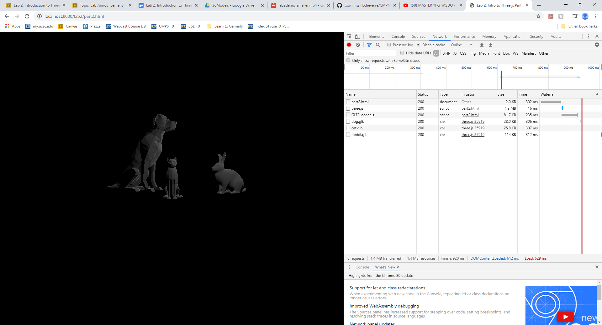
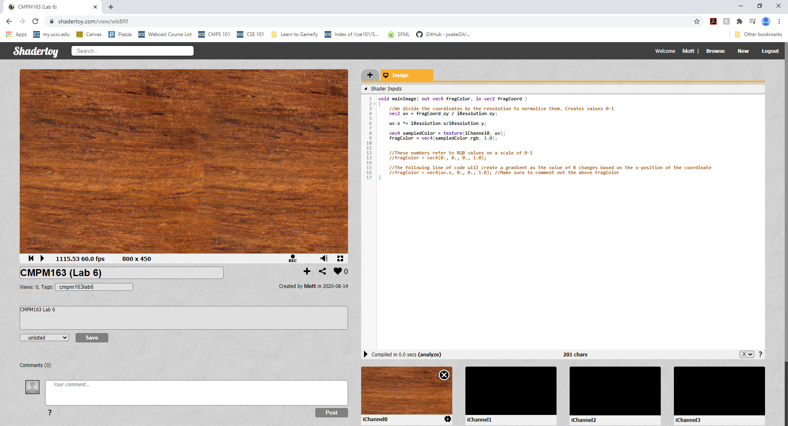

# CMPM163Labs
Labs for CMPM163

Lab 2: https://drive.google.com/open?id=1p7jVCXOAZbUHViSDmdubP9u51xBdehHg

Lab 5: 
I chose to do part one on Unity
Here is the video: https://drive.google.com/file/d/1rn4aGQ-F8f-nXfqEBejHOXW82g2m5f83/view?usp=sharing
I made the particles a dark gray and reversed gravity so that it would be kinda like a smoke effect. I also changed the mountains in the background to be more purple and the hills that were up close to be more orange, and changed the clouds to be sort of reddish to make the scene seem more "sunset-like." I did this all by changing the albedo for all those materials using the color editor. 
When I went to upload the project to github, it was too large, and I couldn't get the .gitignore to work, so I only uploaded the asset that I modified from the assignment, I hope that that is alright

Lab 6:
I chose to do part 2 with shadertoy
here is the texture with the corrected aspect ratio: 
Here is my work: https://www.shadertoy.com/view/wlsBRf
Here is a galaxy piece that I thought was very cool looking: https://www.shadertoy.com/view/MdXSzS

Lab 7:
Here is the video: https://drive.google.com/file/d/1DuC0q0cx6aLU2OO0XilXQuFDGRfSEPmT/view?usp=sharing
At first I tried to make a perlin noise wave for the mountain side, as I knew that that was how they had done minecraft, but after tinkering around with it, I relaized that the plane gameObject did not have enough vertices for that to work, so I tried to create a plane in Maya with more vertices, but then I couldn't get that to work. In the end, I ended up using a sphere that I just squash and stretched until it was almost a plane, and then submerged half of it beneath the water. I created a light and then edited it so that it would not create shadows, so that it would have this almost watercolor look to the scene.
